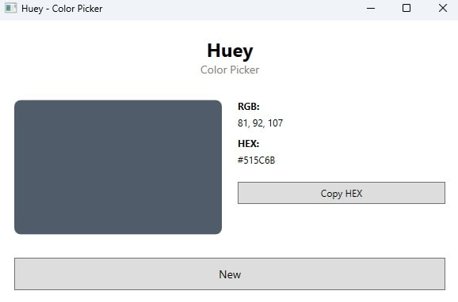

# Huey - Colour Picker

## About Huey
Welcome to Huey — an open source colour picker app for Windows, in development with WPF and .NET. Unlike many colour pickers that are only available as browser extensions, Huey is planned as a full-featured desktop application. This project was started because I couldn’t find a modern, standalone colour picker, and I wanted to learn C# and WPF by building something useful for the community. Contributions and feedback are always welcome!

## Requirements 

- Windows 10 or later (x64)
- .NET 8.0 Desktop Runtime
(Download from: https://dotnet.microsoft.com/en-us/download/dotnet/8.0)
- No installation required (portable EXE, just run)
- Screen capture permissions (if prompted by Windows)
